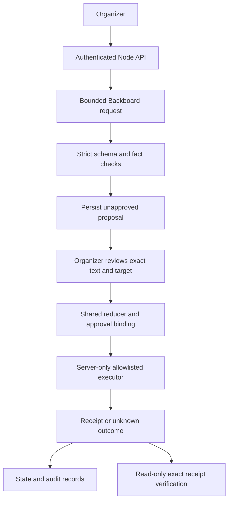

# Orbit orchestration review

Reviewed September 20, 2026 against the implemented single-organizer application.

## Design

Orbit has one server-side agent with two generation workflows, planning and conversation. These are capabilities of Communauté, not independent autonomous agents. Provider tools return structured proposals; they are not executable integration tools. Adding a multi-agent framework would not solve a demonstrated problem here.

Chat drafts enter the same proposal workflow only after the organizer explicitly selects a saved draft. The server checks its conversation revision and loads the selected text itself. A second, separate approval is required to publish.

## Boundaries checked

| Concern | Implementation and verification |
|---|---|
| Model authority | One complete propose_plan or reply tool response; no tool directly sends a message or creates an event. Strict schemas reject injected action types and extra fields. |
| Untrusted context | System prompts distinguish source content and conversation from orchestration instructions. Structural validation and server tool allowlists remain the enforcement boundary. |
| Approval scope | Canonical payload, displayed destination, capability and opaque execution-configuration fingerprint. Account, channel ID, calendar ID, webhook or pinned tool-version changes require a new proposal. Legacy real proposals without a fingerprint cannot execute. |
| State ownership | Reducer governs proposal and action state. Server loads stored actions rather than executing arbitrary submitted payloads. Shared-fact edits invalidate affected approvals. |
| Concurrency | Same execution key shares its in-flight promise; successful receipts are reused. Only one external action is dispatched at a time. Chat has revision checks and a per-conversation lock; planning discards stale sequence responses. |
| Failure containment | Bounded network timeouts; at most one model-format repair, reserving budget again. No automatic execution retry after uncertainty. Restarted in-flight actions become unknown. |
| Recovery | Exact persisted Composio log ID, account, tool and request comparison. Success can update state through the reducer without invoking an execution tool. Missing or mismatched evidence never authorizes retry. |
| Observability | Request IDs, append-only decision/execution records, explicit manual confirmations. Opaque configuration hashes avoid exposing webhook secrets. |
| Validation evidence | Core regressions cover schemas, approval gates, changed configuration, receipt envelopes, duplicate execution and recovery. Browser tests cover user review, chat handoff, inline errors and no publication before approval. |

## Corrections made in this review

1. Bound actual execution configuration to the reviewed action, rather than only a human-readable destination label.
2. Rechecked the approval's destination at reducer and executor boundaries.
3. Made planning's untrusted-document boundary explicit and prohibited synthetic history as live event facts.
4. Updated chat instructions to describe the implemented explicit draft-to-approval handoff.

## Remaining limits

- This is a single-process design. JSON state and audit files are not a transactional database; a crash between remote success and local persistence can require manual recovery. No exactly-once guarantee across crashes or newly generated duplicate plans.
- Cost accounting is a conservative process-local reservation, not actual provider billing. Restart resets the reservation. Persistent accounting and provider usage reconciliation remain future work.
- Fact extraction recognizes explicit supported formats, not every possible phrasing. Grounding checks are deterministic syntax checks, not semantic proof. Organizer review remains necessary.
- Saved context is a dated snapshot, not an automatically synchronized knowledge base. Source IDs do not prove that a claim is correct.
- Legacy attempts and timeouts without a captured Composio log ID still require destination checks. Definitive failures do not currently expose an automatic retry action.
- End-to-end request deadlines, cancellation of superseded generation, and durable cross-process locks remain hardening work.

Do not introduce automatic posting, independent agents, queues, or schedulers merely to expand the stack. Add them only for a concrete workflow, with the same approval and recovery contracts.
